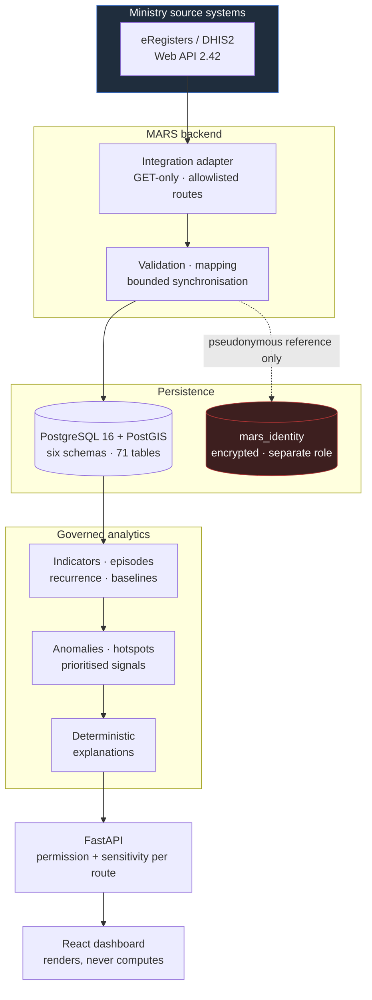
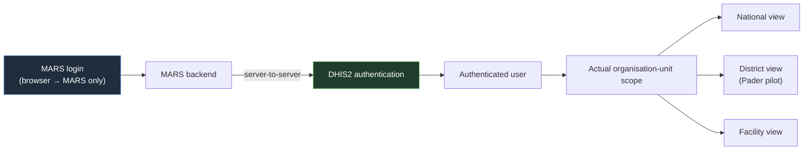

<div align="center">

# MARS

### Malaria Antimalarial Resistance Surveillance

**Routine health-system data becomes governed, explainable surveillance signals —
each one traceable to its evidence, and none of them claiming more than the data can bear.**

[](https://www.python.org/)
[](https://fastapi.tiangolo.com/)
[](https://react.dev/)
[](https://www.typescriptlang.org/)
[](https://postgis.net/)
[](https://dhis2.org/)

</div>

---

> ### ⚠️ Interpretation boundary
>
> **MARS signals identify patterns requiring investigation. They do not, by
> themselves, confirm antimalarial resistance.**
>
> Routine e-register and HMIS data cannot distinguish recrudescence from
> reinfection, prove drug exposure or adherence, identify parasite genotype, or
> confirm molecular markers. Confirming resistance requires a reference
> laboratory and a study design. That evidence reaches MARS through a separately
> governed lane it cannot write into.
>
> A repository-wide terminology lint enforces this in CI and fails the build on
> prohibited phrasing. See [ADR 0005](docs/adr/0005-scientific-terminology-and-evidence-lanes.md).

---

## Product status

MARS runs in two clearly separated modes. They never share a process or a database.

| Environment | What it is | Data |
| --- | --- | --- |
| **Pader Live Pilot** | Real, authorised DHIS2/eRegisters integration against a single district | Live synchronised HMIS and Tracker data |
| **National Overview** | Synthetic demonstration environment for national-scale product development | Deterministic synthetic data, visibly labelled |
| **National live deployment** | **Not claimed.** No national environment has been provisioned | — |

The live mode refuses the demonstration database at startup, and the API
response schema for a live snapshot is typed `synthetic_data_used: Literal[False]`
— the contract itself cannot carry a synthetic figure.

---

## Why MARS exists

Malaria programme information arrives in pieces that rarely meet:

- **aggregate reporting** — HMIS 033b weekly, HMIS 105 monthly
- **patient encounters** — the OPD e-register, one row per visit
- **laboratory results** — RDT and microscopy, recorded separately
- **treatment and commodity data** — what was given, what was in stock

A district officer asking *"is something wrong here?"* has to reconcile those by
hand, usually too late. And the pattern that most often prompts the question —
patients returning still positive after treatment — has many explanations before
drug resistance: reinfection in a high-transmission season, an incomplete course,
a stock-out that changed what was prescribed, or a facility that simply started
reporting more carefully.

MARS exists to make that pattern **visible early, attributable to its evidence,
and honestly bounded**. It tells you where to look. It does not tell you what you
will find.

---

## What MARS does

| Capability | Detail |
| --- | --- |
| **DHIS2/eRegisters authentication** | One login; organisation-unit scope resolved from the authenticated account |
| **HMIS ingestion** | 033b and 105, strict contract, quarantine, lineage, checksum, reconciliation |
| **Encounter and episode construction** | Canonical OPD encounters grouped into governed malaria episodes |
| **Recurrence surveillance** | Repeat-positive intervals against approved bands |
| **Testing and positivity monitoring** | Testing rate, positivity, RDT and microscopy split |
| **Treatment monitoring** | Treatment patterns against confirmed diagnosis |
| **Commodity surveillance** | Stock on hand, days out of stock, consumption — kept as *operational* alerts |
| **Data-quality diagnostics** | Completeness, timeliness, internal consistency, denominator validity |
| **Spatial analysis** | Geographic aggregation, hotspots and clustering under a privacy policy |
| **Signal prioritisation** | Governed rules, typed evidence, both supporting and counter-evidence |
| **Investigations** | Queues, transitions and an append-only timeline that never mutates the signal |
| **Reporting and explainability** | Deterministic explanations, governed exports, full audit trail |

Every threshold, window, weight, privacy minimum, priority band and SLA is
**configuration under governance**. MARS implements the mechanisms and ships no
values. Each engine that lacks an approved method reports `not_configured` and
names the key it is waiting for — it does not fall back to a default and it does
not show zeroes.

> A country of zeroes would look finished, and it would be wrong. The difference
> between *no malaria* and *no analysis* is the difference this system is built
> around.

---

## Live Pader pilot

The pilot authenticates a real, authorised eRegisters user and reads only what
that account may see.

| Verified | Value |
| --- | --- |
| DHIS2 version | 2.42.5.1 |
| Accessible programmes | 1 |
| Programme stages | 4 |
| Data elements discovered | 5,330 |
| Facilities under the account | 27 |

Approved mapping: [`config/dhis2/pader-live-v1.json`](config/dhis2/pader-live-v1.json)
— DHIS2 metadata UIDs only, carrying a SHA-256 of the discovery report it was
derived from.

**What the pilot does**

- authenticates the user server-to-server, then resolves their actual
  organisation-unit scope
- reads mapped aggregate HMIS values for authorised facilities
- performs bounded Tracker event reads for repeat-positive evidence
- builds a 12-month real HMIS trend and district KPIs
- derives data-quality diagnostics and operational commodity conditions
- withholds mathematically invalid ratios rather than publishing them

**What it never does**

- substitute a demonstration figure into live mode
- request tracked-entity attributes
- return a DHIS2 tracked-entity UID to the browser
- invent a facility coordinate for the map
- describe a Pader snapshot as national

> **On scope naming.** The verified pilot account resolves to Pader District. The
> interface calls this the **Pader Overview**. National, district and facility
> routing is driven by the account's real remote scope, never by a hardcoded
> username.

### Withheld ratios, and why

An earlier build displayed a testing rate of **249.7%** — the mapped "tested"
numerator exceeded the "suspected" denominator. The fix was not to clamp the
number. A ratio whose numerator and denominator are incompatible is withheld
entirely: value, numerator and denominator are all dropped, the measure reports
`unavailable`, and a data-quality alert states plainly that reported tests exceed
suspected reports and that no testing rate is published.

A wrong percentage is worse than an absent one, because someone will act on it.

---

## Architecture



**Authentication and scope resolution**



The browser sends credentials to the MARS backend and nowhere else. DHIS2
credentials and tokens never reach browser JavaScript.

---

## Privacy and security

| Control | Implementation |
| --- | --- |
| **Server-to-server only** | The browser never contacts DHIS2; credentials never reach React |
| **Credentials never persisted** | Held in process memory, keyed by session, injected into one operation and never returned to a caller |
| **Opaque sessions** | HttpOnly cookies; the store holds a hash, never the raw identifier |
| **Least-privilege scope** | Organisation-unit scope comes from the authenticated DHIS2 account |
| **Scope enforced in SQL** | Never by filtering results afterwards. A facility's district membership does not grant the district-wide picture |
| **Identity separation** | `mars_identity` is a separate schema on a separate database role; migration `0025` revokes it from the application role |
| **Pseudonymous references** | Patient aliases are keyed HMAC with domain separation — never a truncated source identifier, and no fallback key exists |
| **No probabilistic matching** | No linkage on names, phone numbers, villages or addresses |
| **Sanitised errors** | Upstream failures report an exception *type*; no URL, credential or record content reaches a log or a response |
| **Audit trail** | Append-only, with no update or delete path |
| **No synthetic fallback** | Live mode fails closed and says so |

Out-of-scope reads return **404**, not 403 — a 403 would confirm that something
exists there.

---

## Technology

| Layer | Stack |
| --- | --- |
| **API** | Python 3.12, FastAPI 0.115, Pydantic v2 |
| **Data** | SQLAlchemy 2, Alembic, psycopg 3, PostgreSQL 16, PostGIS, GeoAlchemy2 |
| **Frontend** | React 18, TypeScript 5.7, Vite 6, TanStack Query 5, MapLibre GL |
| **Integration** | DHIS2 Web API 2.42 (GET-only, host/route/query allowlists) |
| **Quality** | Ruff, mypy (strict), pytest, Vitest, Testing Library, Playwright |
| **Contract** | OpenAPI generated from the API; TypeScript types generated from it; CI fails on drift |

The frontend computes **no analytical value**. Every figure arrives as a record
carrying its period, scope, source, method version and availability status, so
there is no KPI formula in the browser to disagree with the server about.

---

## Repository structure

```
backend/
  src/mars/
    api/            FastAPI routers — no queries, no ORM models
    domain/         SQLAlchemy models across six schemas
    analytics/      Indicators, episodes, baselines, anomalies, spatial
    signals/        Governed prioritisation
    explainability/ Deterministic explanations
    investigations/ Workflow and append-only history
    integrations/   DHIS2 adapters — discovery, login, tracker, live dashboard
    identity/       Encrypted vault, linkage, never imported by analytics
    services/       Scope-applying read models
  migrations/       Alembic revisions 0001 → 0025
  tests/            unit · api · security · integration
frontend/
  src/features/     command-centre, signals, investigations, patients, map, …
  src/design-system/
  tests/
config/dhis2/       Approved mapping (metadata UIDs only)
contracts/          Generated OpenAPI document
docs/               ADRs, architecture, runbooks, data dictionary, security
scripts/            Launchers, lints, audits, backup/restore
infra/              Compose topology
```

Architectural rules are enforced by tests, not convention: routers hold no
queries, analytics never imports an adapter or the identity package, and
`mars.ai` is a leaf that a disabled deployment never loads.

---

## Local development

**Prerequisites** — Python 3.12+, Node 20+, PostgreSQL 16 with PostGIS 3.4+.

```bash
# Backend
cd backend
python -m venv .venv
.venv/Scripts/pip install -e ".[dev]"      # POSIX: .venv/bin/pip

# Frontend
npm --prefix frontend install
```

Configuration arrives through the environment. Copy `.env.example` and fill in
your own values — **placeholders below, never real credentials**:

```bash
MARS_ENVIRONMENT=development
MARS_DATABASE_URL=postgresql+psycopg://USER@HOST:5432/mars_local
MARS_IDENTITY_DATABASE_URL=postgresql+psycopg://IDENTITY_USER@HOST:5432/mars_local
MARS_IDENTITY_ENCRYPTION_KEY=<64 hex characters>
MARS_IDENTITY_LINKAGE_KEY=<64 hex characters>
```

Passwords are supplied through `PGPASSWORD`, a `.pgpass` file or the
orchestrator's secret store — never in a URL that appears in a process list.

```bash
# Migrations, then geography, then the demonstration dataset
cd backend && .venv/Scripts/alembic upgrade head
.venv/Scripts/python -m mars.ingestion.geography.cli --data-dir <repo root>
python scripts/seed_development.py
.venv/Scripts/python -m mars.demo.cli generate --out-dir ./demo
.venv/Scripts/python -m mars.demo.cli register --out-dir ./demo

# Run
.venv/Scripts/uvicorn mars.main:app --reload --port 8000
npm --prefix frontend run dev          # http://127.0.0.1:5173
```

---

## Live pilot startup

```powershell
./scripts/start-mars-live.ps1            # start
./scripts/start-mars-live.ps1 -Restart   # replace existing MARS listeners
```

The launcher applies migrations to the `mars_live` database, starts the API on
**port 8000** and the UI on **port 5173**.

- The database password is read with a **hidden prompt** (`Read-Host -AsSecureString`)
  and the plaintext buffer is zeroed immediately after use.
- Local pilot keys are stored under `.local-secrets/` encrypted with Windows
  DPAPI. That directory is gitignored; **no key material is ever committed**.
- If a previously generated DPAPI blob cannot be decrypted — a different Windows
  identity, or a restored profile — the script can fall back to process-only keys
  for the session.
- `-Restart` refuses to stop a process that is not the expected Python or Node
  listener on that port.
- Credentials are never printed.

A separate `./scripts/start-mars-demo.ps1` runs the synthetic environment. The two
launchers are isolated and the settings layer refuses to start live mode against
the demonstration database.

---

## Quality and verification

Every figure below was produced by re-running the command in this repository.

| Check | Command | Result |
| --- | --- | --- |
| Ruff format | `ruff format --check .` | 260 files clean |
| Ruff lint | `ruff check .` | clean |
| Type checking | `mypy` | clean, 189 source files |
| Backend tests | `pytest tests -m "not integration"` | **1,099 passed** |
| Frontend lint | `npm run lint` | clean |
| Frontend types | `npm run typecheck` | clean |
| Frontend tests | `vitest --run` | **111 passed** (11 files) |
| Production build | `npm run build` | succeeds; MapLibre split into its own chunk |
| OpenAPI contract | `export_openapi.py --check` | up to date |
| Terminology lint | `terminology_lint.py` | no prohibited claims |
| Geography audit | `geography_audit.py --verify-only` | PASS — all four sources unchanged |
| Migrations | `alembic heads`, offline render | single head `0025`, 71 tables, both directions render, no identifier over 63 characters |
| PowerShell | AST parse | 4 scripts, no errors |

Integration tests and the live `alembic check` drift gate require a PostgreSQL
cluster; see [the release checklist](docs/runbooks/release-checklist.md).

---

## Current limitations

Stated rather than discovered.

- **No national deployment.** No environment has been provisioned. MARS is not
  running at any public URL, and nothing here claims otherwise.
- **Pilot scope is one district.** The verified account resolves to Pader.
- **Population denominators are unavailable.** No incidence per head of
  population is computed; every rate takes its denominator from reported data.
- **Parish and village geography is empty.** No boundary data was supplied and
  MARS does not fabricate geography.
- **Secondary suppression is not implemented.** Single small cells are
  suppressed; differencing attacks are not defended.
- **Rate limiting belongs at the proxy**, not in the application.
- **Notifications are not delivered.** Closing an investigation notifies nobody.
- **EWMA and CUSUM** detection methods are not implemented.
- **No screenshots are published yet.** Producing one requires a live session,
  and no image has been captured that is verified free of account and patient
  detail. A fabricated one would misrepresent the product.
- **Licensing is not yet specified.** No licence file exists in this repository,
  so no licence is claimed or implied.

---

## Documentation

| Document | Contents |
| --- | --- |
| [Architecture and data flow](docs/architecture/data-flow.md) | The two evidence lanes, the pipeline, enforced properties |
| [Deployment runbook](docs/runbooks/deployment.md) | Requirements, environment, startup order, health checks |
| [Operations runbook](docs/runbooks/operations.md) | Data refresh, DHIS2, governance activation, monitoring |
| [Release checklist](docs/runbooks/release-checklist.md) | Every gate, in order |
| [Backup and recovery](docs/runbooks/backup-and-recovery.md) | Backup, restore, tested drill |
| [Permission matrix](docs/security/permission-matrix.md) | Every route's permission and sensitivity tier |
| [ADRs](docs/adr/) | The architectural decisions and the tests enforcing them |

---

## Author

**Isaac Omoding** — [@Isaac25-lgtm](https://github.com/Isaac25-lgtm)

Designer and developer of MARS.

---

<div align="center">

*Routine data can tell you where to look. It cannot tell you that a drug has
stopped working.*

*Everything here is the first half, done honestly, so the second half is worth doing.*

</div>
